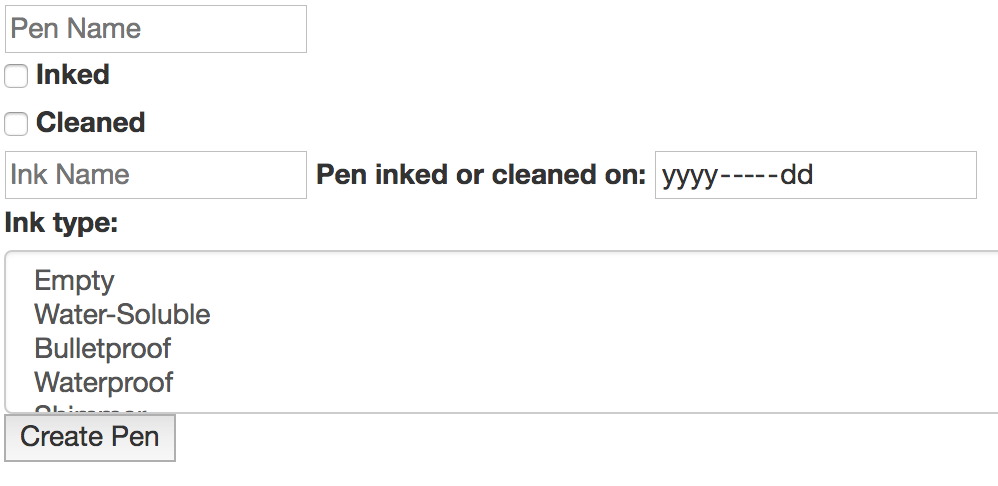

# Pen Feed Client

This is a capstone project built at General Assembly's Web Development Immersive.

This repository is the client side of the project. The API or backend of the
project is [here](https://github.com/sparrowr/pen-feed-backend).

This is a screenshot of this project:

## Components of this Project

The frontend client repository is [here](https://github.com/sparrowr/pen-feed-client).

The backend API repository is [here](https://github.com/sparrowr/pen-feed-backend).

The deployed frontend client is [here](https://sparrowr.github.io/pen-feed-client/).

The deployed backend API is [here](https://evening-falls-18430.herokuapp.com/).

## What this app does and how it works

This app allows users to record information about fountain pens, and then retrieve
that information later. It automatically calculates how soon pens should be cleaned
based on when they were filled with ink and what kind of ink it was, and lists pens
that need cleaning more badly ahead of pens that don't need to be cleaned yet.

I hope to eventually have this tool track ink use and overall pen activity history.
Ultimately, I would like to use it as a replacement for a Google Drive spreadsheet
I'm currently using for this hobby.

## Structure of this Repository

JavaScript files are all in [`assets/scripts`](assets/scripts). The "manifest"
or entry-point is [`assets/scripts/index.js`](assets/scripts/index.js). That
file invokes [`assets/scripts/auth/events.js`](assets/scripts/auth/events.js) and [`assets/scripts/pens/events.js`](assets/scripts/pens/events.js),
which contain event listeners for the visible and hidden content on the page.

Specifically, the authentication content is handled in [`assets/scripts/auth`](assets/scripts/auth) and the pen content is in [`assets/scripts/blog`](assets/scripts/pens).

`apiUrls.production` and `apiUrls.development` are configured in
[`config/environment.js`](config/environment.js).

Styles are stored in [`assets/styles`](assets/styles) and loaded
from [`assets/styles/index.scss`](assets/styles/index.scss). Bootstrap version 3 is
included in this project.

[`getFormFields`](get-form-fields.md) is used to retrieve form data to send to an
API.

## Setting Up and Installing This Project

1. Install a local copy of this repository on your computer.
1. Run `npm install` and then `grunt serve` from the project folder to run a local version of this project on your computer. You will also need an instance of the backend API for the client to talk to.
1. To deploy a version of this project to GitHub Pages, run `grunt deploy`. You will need write permissions to the GitHub repository you have configured as your origin.

## User Stories

1. As a fountain pen user, I want to be able to record when fountain pens are filled with ink ("inked") and have a computer keep track of when they need to be cleaned.
2. As a disorganized person, I really don't want strangers on the Internet to see how long I've left pens inked.
3. As a person who likes friendly interfaces, I would like the feedback for "this pen has been inked too long" to be clearer and better-looking than the conditional formatting/color-coding in Google Sheets I'm currently using.
4. As a person who occasionally uses ink types that require pens to be cleaned more often than usual, I would like the pen feed web application to cover that information as well.
5. As a person who sometimes shares pens with friends and cleans my fiance's pens, I would like to be able to share pen data with other users.
6. As a person who likes data, I would like to be able to search/filter pen lists using pen traits like nib size or manufacturer.
7. As a person who likes having complete records of pen and ink use and is finding the spreadsheet method increasingly unwieldy, I would like to eventually expand this to include managing the state of ink cartridges/bottles/samples.
8. On that note of complete records but simpler management, it'd be fantastic if this allowed users to record actions/events that automatically updated the appropriate pen(s) and ink(s).

## Wireframes

Wireframes for this project are on Google Drive, [here](https://docs.google.com/drawings/d/1ZsJyUSZJPNzLcXiPQwZQSqHwPPiN38OCmamodHdNRYU/edit?usp=sharing ).

## Planning, Process, and Problem-Solving

I tracked my progress using handwritten notes and Google Drive documents.I started
by taking notes on the way I have been using the spreadsheet I'd like to eventually
replace with this project. Then I created the ERD, wireframes, and user stories.

Since I knew I'd need date math for this project, I looked into how dates work
in Rails and in Express, and decided to use Express (in part because this means only
dealing with date math in one language).

I set up authentication, deployed the frontend and backend, and made sure the
authentication was working before working on anything specific to this project.

On this project, I built the pens resource on the backend, used curl scripts to make
sure it ran properly, then deployed it. Since I began working on the frontend, I've
only made minor changes to the backend.

On the frontend, I started by setting up the Create action for the pens resource,
then Read, then Update and finally Destroy. Create, Read, and Update were all
moderately complex, but Destroy was very simple.

Once the project requirements were met, I spent a bunch of time improving the design
and making it more accessible and better looking.

## Unsolved Problems and Possible Future Tasks

1. Authentication is currently done through code hand-rolled by General Assembly instructors. Among other problems, this code never checks if the content in the "password" and "confirm password" boxes on the signup page are the same.
1. There's no history/logging, so it's not possible to see past events or trends.
1. There's no way to share pen information with other users.
1. Users cannot store information about ink use anywhere in this app.
1. The "Inked" and "Cleaned" check-boxes are somewhat small and could be improved.

## Credits and Technologies Used

- This was derived from the [GA template](https://git.generalassemb.ly/ga-wdi-boston/browser-template)
- It was designed based on [this list of requirements](https://git.generalassemb.ly/ga-wdi-boston/capstone-project/blob/master/requirements.md)
- This project uses JavaScript, and the JavaScript tools Bootstrap 3, Express, Handlebars, NPM, and JQuery.
- Express uses Mongoose in order to store documents in MongoDB.
- Some pen cleaning recommendations came from [Jetpens](https://www.jetpens.com)
- Colors were chosen using the [Material Design Guide](https://material.io/design/color/the-color-system.html#tools-for-picking-colors) and the [WebAIM Contrast Checker](https://webaim.org/resources/contrastchecker/)

## [License](LICENSE)

1. All content is licensed under a CC­BY­NC­SA 4.0 license.
1. All software code is licensed under GNU GPLv3. For commercial use or
    alternative licensing, please contact legal@ga.co.
